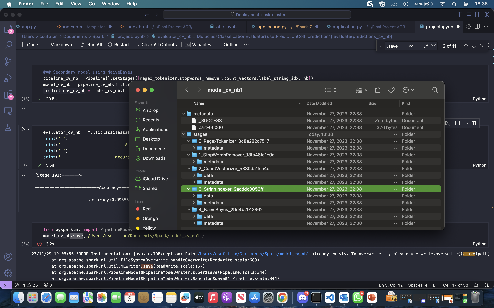
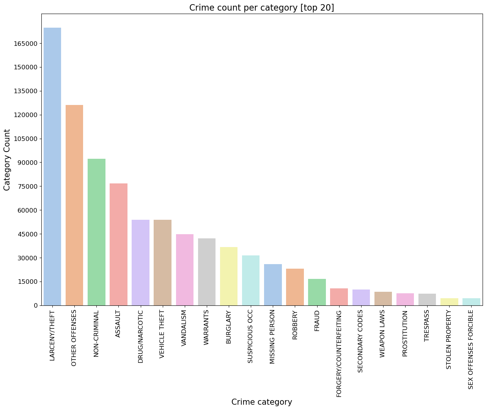
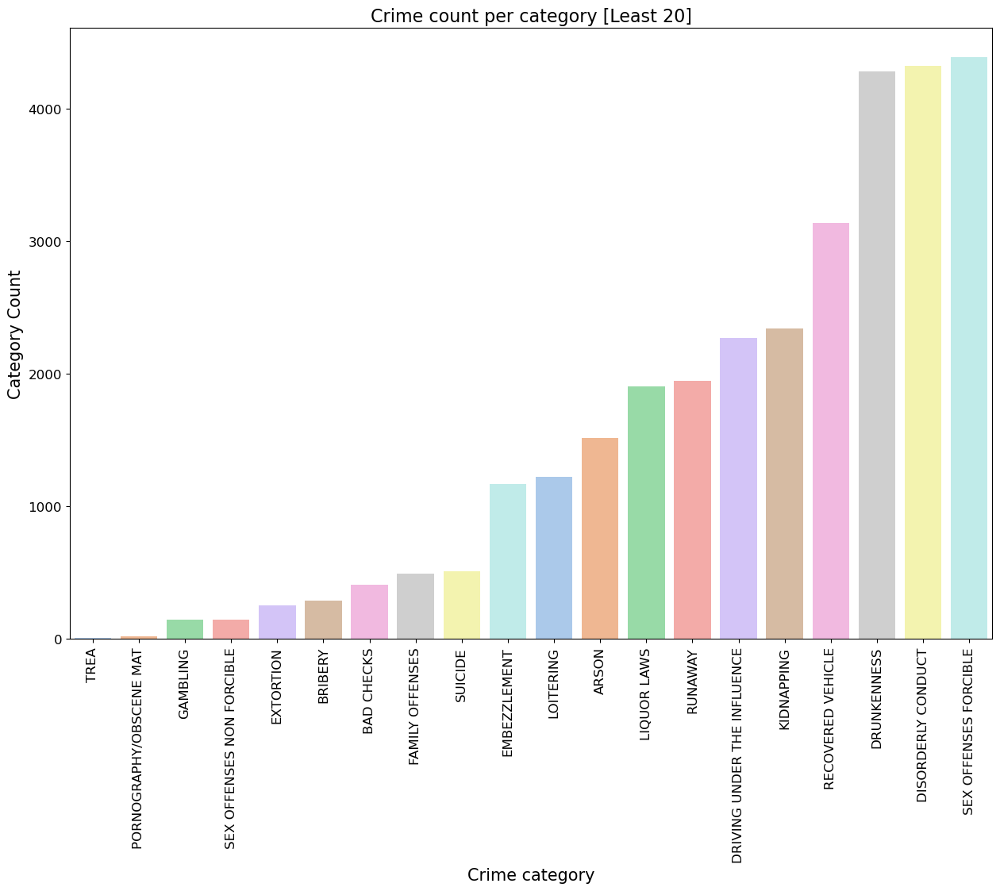
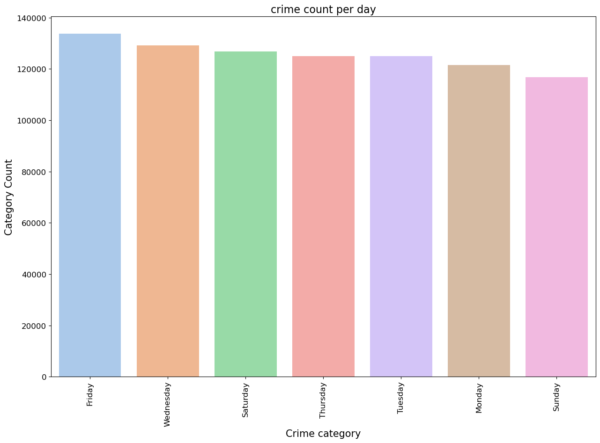

#                                                     __Crime Classification Model using Pyspark__


## 1. __Scope__
* We aim to develop a system for categorizing crime descriptions into distinct categories, facilitating the automatic assignment of crimes to categories. This system will aid law enforcement in assigning the appropriate officers to a given crime or automatically assigning officers based on the classification.

* Utilizing a Kaggle dataset on Crime Classification, our task involves training a model on 39 pre-defined categories, assessing model accuracy, and deploying it to production. The objective is to have the system assign a new crime description to one of the 39 categories.

* To address this challenge, we will employ various feature extraction techniques and diverse supervised machine learning algorithms in PySpark. The nature of this task is a multi-class text classification problem.


## __2. Setup Spark and load other libraries__


```python
import pyspark
spark = pyspark.sql.SparkSession.builder.appName("clipper-pyspark").getOrCreate()

sc = spark.sparkContext
```


```python
import seaborn as sns
import matplotlib.pyplot as plt
import numpy as np
%matplotlib inline
np.random.seed(60)
```

## __3. Data Extraction__


```python
#Read the data into spark datafrome
from pyspark.sql.functions import col, lower
df = spark.read.format('csv')\
          .option('header','true')\
          .option('inferSchema', 'true')\
          .option('timestamp', 'true')\
          .load('hdfs://127.0.0.1:9000/user/ADB_Project/train.csv')

data = df.select(lower(col('Category')),lower(col('Descript')))\
        .withColumnRenamed('lower(Category)','Category')\
        .withColumnRenamed('lower(Descript)', 'Description')
data.cache()
print('Dataframe Structure')
print('----------------------------------')
print(data.printSchema())
print(' ')
print('Dataframe preview')
print(data.show(5))
print(' ')
print('----------------------------------')
print('Total number of rows', df.count())
```

    Dataframe Structure
    ----------------------------------
    root
     |-- Category: string (nullable = true)
     |-- Description: string (nullable = true)
    
    None
     
    Dataframe preview
    +--------------+--------------------+
    |      Category|         Description|
    +--------------+--------------------+
    |      warrants|      warrant arrest|
    |other offenses|traffic violation...|
    |other offenses|traffic violation...|
    | larceny/theft|grand theft from ...|
    | larceny/theft|grand theft from ...|
    +--------------+--------------------+
    only showing top 5 rows
    
    None
     
    ----------------------------------
    Total number of rows 878049


**Explanation**: __To familiar ourselves with the dataset, we need to see the top list of the crime categories and descriptions__.


```python
def top_n_list(df,var, N):
    '''
    This function determine the top N numbers of the list
    '''
    print("Total number of unique value of"+' '+var+''+':'+' '+str(df.select(var).distinct().count()))
    print(' ')
    print('Top'+' '+str(N)+' '+'Crime'+' '+var)
    df.groupBy(var).count().withColumnRenamed('count','totalValue')\
    .orderBy(col('totalValue').desc()).show(N)
    
    
top_n_list(data, 'Category',39)
print(' ')
print(' ')
top_n_list(data,'Description',40)
result_df = df.groupBy('Category').count() \
    .withColumnRenamed('count', 'totalValue') \
    .orderBy(col('totalValue').desc())
```

    Total number of unique value of Category: 39
 
	Top 39 Crime Category
																			   
	+--------------------+----------+
	|            Category|totalValue|
	+--------------------+----------+
	|       larceny/theft|    174900|
	|      other offenses|    126182|
	|        non-criminal|     92304|
	|             assault|     76876|
	|       drug/narcotic|     53971|
	|       vehicle theft|     53781|
	|           vandalism|     44725|
	|            warrants|     42214|
	|            burglary|     36755|
	|      suspicious occ|     31414|
	|      missing person|     25989|
	|             robbery|     23000|
	|               fraud|     16679|
	|forgery/counterfe...|     10609|
	|     secondary codes|      9985|
	|         weapon laws|      8555|
	|        prostitution|      7484|
	|            trespass|      7326|
	|     stolen property|      4540|
	|sex offenses forc...|      4388|
	|  disorderly conduct|      4320|
	|         drunkenness|      4280|
	...
	+--------------------+----------+
	Output is truncated. View as a scrollable element or open in a text editor. Adjust cell output settings...                                                                              

	Total number of unique value of Description: 879
	 
	Top 40 Crime Description
																		  

	+--------------------+----------+
	|         Description|totalValue|
	+--------------------+----------+
	|grand theft from ...|     60022|
	|       lost property|     31729|
	|             battery|     27441|
	|   stolen automobile|     26897|
	|drivers license, ...|     26839|
	|      warrant arrest|     23754|
	|suspicious occurr...|     21891|
	|aided case, menta...|     21497|
	|petty theft from ...|     19771|
	|malicious mischie...|     17789|
	|   traffic violation|     16471|
	|petty theft of pr...|     16196|
	|malicious mischie...|     15957|
	|threats against life|     14716|
	|      found property|     12146|
	|enroute to outsid...|     11470|
	|grand theft of pr...|     11010|
	|possession of nar...|     10050|
	|petty theft from ...|     10029|
	|petty theft shopl...|      9571|
	|grand theft from ...|      9512|
	|        found person|      9317|
	...
	|violation of rest...|      5816|
	+--------------------+----------+
	only showing top 40 rows


## __4. Partition the dataset into Training and Test dataset__


```python
training, test = data.randomSplit([0.7,0.3], seed=60)
#trainingSet.cache()
print("Training Dataset Count:", training.count())
print("Test Dataset Count:", test.count())
```

    Training Dataset Count: 615417
    Test Dataset Count: 262632


## __5. Define Structure to build Pipeline__
__The process of cleaning the dataset involves:__  
* __Define tokenization function using RegexTokenizer__: The RegexTokenizer enables advanced tokenization based on regular expression (regex) matching. By default, the "pattern" parameter (regex, default: "\s+") serves as delimiters for splitting the input text. Alternatively, users can set the "gaps" parameter to false, indicating that the regex "pattern" denotes "tokens" instead of splitting gaps. This results in finding all matching occurrences as the tokenization result.

* __Define stop remover function using StopWordsRemover__: StopWordsRemover takes a sequence of strings (e.g., the output of a Tokenizer) as input and eliminates all stop words from the input sequences. The stopWords parameter specifies the list of stopwords.

* __Define bag of words function for Descript variable using CountVectorizer__: CountVectorizer serves as an estimator to extract the vocabulary and generates a CountVectorizerModel. The model produces sparse representations for the documents over the vocabulary, which can be passed to other algorithms like LDA. During the fitting process, CountVectorizer selects the top vocabSize words ordered by term frequency across the corpus. An optional parameter, minDF, also affects the fitting process by specifying the minimum number (or fraction if < 1.0) of documents a term must appear in to be included in the vocabulary.

* __Define function to Encode the values of category variable using StringIndexer__: StringIndexer encodes a string column of labels to a column of label indices. The indices range from 0 to numLabels, ordered by label frequencies. In our case, the label column (Category) will be encoded into label indices from 0 to 38, with the most frequent label (LARCENY/THEFT) indexed as 0.

* __Define a pipeline to call these functions__: ML Pipelines offer a uniform set of high-level APIs built on top of DataFrames, assisting users in creating and tuning practical machine learning pipelines.


```python
from pyspark.ml.feature import RegexTokenizer, StopWordsRemover, CountVectorizer, OneHotEncoder, StringIndexer, VectorAssembler, HashingTF, IDF, Word2Vec
from pyspark.ml import Pipeline
from pyspark.ml.classification import LogisticRegression, NaiveBayes 

#----------------Define tokenizer with regextokenizer()------------------
regex_tokenizer = RegexTokenizer(pattern='\\W')\
                  .setInputCol("Description")\
                  .setOutputCol("tokens")

#----------------Define stopwords with stopwordsremover()---------------------
extra_stopwords = ['http','amp','rt','t','c','the']
stopwords_remover = StopWordsRemover()\
                    .setInputCol('tokens')\
                    .setOutputCol('filtered_words')\
                    .setStopWords(extra_stopwords)
                    

#----------Define bags of words using countVectorizer()---------------------------
count_vectors = CountVectorizer(vocabSize=10000, minDF=5)\
               .setInputCol("filtered_words")\
               .setOutputCol("features")


#-----------Using TF-IDF to vectorise features instead of countVectoriser-----------------
hashingTf = HashingTF(numFeatures=10000)\
            .setInputCol("filtered_words")\
            .setOutputCol("raw_features")
            
#Use minDocFreq to remove sparse terms
idf = IDF(minDocFreq=5)\
        .setInputCol("raw_features")\
        .setOutputCol("features")

#---------------Define bag of words using Word2Vec---------------------------
word2Vec = Word2Vec(vectorSize=1000, minCount=0)\
           .setInputCol("filtered_words")\
           .setOutputCol("features")

#-----------Encode the Category variable into label using StringIndexer-----------
label_string_idx = StringIndexer()\
                  .setInputCol("Category")\
                  .setOutputCol("label")

#-----------Define classifier structure for logistic Regression--------------
lr = LogisticRegression(maxIter=20, regParam=0.3, elasticNetParam=0)

#---------Define classifier structure for Naive Bayes----------
nb = NaiveBayes(smoothing=1)

def metrics_ev(labels, metrics):
    '''
    List of all performance metrics
    '''
    # Confusion matrix
    print("---------Confusion matrix-----------------")
    print(metrics.confusionMatrix)
    print(' ')    
    # Overall statistics
    print('----------Overall statistics-----------')
    print("Precision = %s" %  metrics.precision())
    print("Recall = %s" %  metrics.recall())
    print("F1 Score = %s" % metrics.fMeasure())
    print(' ')
    # Statistics by class
    print('----------Statistics by class----------')
    for label in sorted(labels):
       print("Class %s precision = %s" % (label, metrics.precision(label)))
       print("Class %s recall = %s" % (label, metrics.recall(label)))
       print("Class %s F1 Measure = %s" % (label, metrics.fMeasure(label, beta=1.0)))
    print(' ')
    # Weighted stats
    print('----------Weighted stats----------------')
    print("Weighted recall = %s" % metrics.weightedRecall)
    print("Weighted precision = %s" % metrics.weightedPrecision)
    print("Weighted F(1) Score = %s" % metrics.weightedFMeasure())
    print("Weighted F(0.5) Score = %s" % metrics.weightedFMeasure(beta=0.5))
    print("Weighted false positive rate = %s" % metrics.weightedFalsePositiveRate)
    
```

## __6. Build Multi-Classification__
__The stages involve to perform multi-classification include:__
1. Model training and evaluation
   1. Build baseling model
      1. Logistic regression using CountVectorizer features
   2. Build secondary models
      1. Naive Bayes
      2. Logistic regression and Naive Bayes using TF-IDF features
      3. Logistic regression and Naive Bayes using word2Vec
    
 ### __(i) Baseline Model__ 
The baseline model aims to be quick, cost-effective, and simple to set up, producing decent results. Considering baselines is crucial as they iterate rapidly, minimizing time wastage.

#### __(a). Apply Logistic Regression with  Count Vector Features__
Implementing logistic regression on the dataset transformed using count vectors, we will make predictions and score on the test sets. The top 10 predictions, accuracy, and other metrics will be assessed to evaluate the model.

Note: Integrate regex_tokenizer, stopwords_remover, count_vectors, label_string_idx, and lr functions into the pipeline.


```python
pipeline_cv_lr = Pipeline().setStages([regex_tokenizer,stopwords_remover,count_vectors,label_string_idx, lr])
model_cv_lr = pipeline_cv_lr.fit(training)
predictions_cv_lr = model_cv_lr.transform(test)
```


```python
print('-----------------------------Check Top 5 predictions----------------------------------')
print(' ')
predictions_cv_lr.select('Description','Category',"probability","label","prediction")\
                                        .orderBy("probability", ascending=False)\
                                        .show(n=5, truncate=30)
```

    -----------------------------Check Top 5 predictions----------------------------------
     
    +------------------------------+-------------+------------------------------+-----+----------+
    |                   Description|     Category|                   probability|label|prediction|
    +------------------------------+-------------+------------------------------+-----+----------+
    |theft, bicycle, <$50, no se...|larceny/theft|[0.8726782249097988,0.02162...|  0.0|       0.0|
    |theft, bicycle, <$50, no se...|larceny/theft|[0.8726782249097988,0.02162...|  0.0|       0.0|
    |theft, bicycle, <$50, no se...|larceny/theft|[0.8726782249097988,0.02162...|  0.0|       0.0|
    |theft, bicycle, <$50, no se...|larceny/theft|[0.8726782249097988,0.02162...|  0.0|       0.0|
    |theft, bicycle, <$50, no se...|larceny/theft|[0.8726782249097988,0.02162...|  0.0|       0.0|
    +------------------------------+-------------+------------------------------+-----+----------+
    only showing top 5 rows
    


```python
from pyspark.ml.evaluation import MulticlassClassificationEvaluator 
evaluator_cv_lr = MulticlassClassificationEvaluator().setPredictionCol("prediction").evaluate(predictions_cv_lr)
print(' ')
print('------------------------------Accuracy----------------------------------')
print(' ')
print('                       accuracy:{}:'.format(evaluator_cv_lr))
```

     
    ------------------------------Accuracy----------------------------------
     
                           accuracy:0.9721844116763713:


 ### __(ii). Secondary Models__
 #### __(a). Apply Naive Bayes with Count Vector Features__
Naive Bayes classifiers belong to a category of straightforward probabilistic classifiers that employ Bayes' theorem while assuming strong (naive) independence between features. The spark.ml implementation currently accommodates both multinomial naive Bayes and Bernoulli naive Bayes.   

 Incorporate the regex_tokenizer, stopwords_remover, count_vectors, label_string_idx, and nb functions into the pipeline for seamless integration.


```python
### Secondary model using NaiveBayes
pipeline_cv_nb = Pipeline().setStages([regex_tokenizer,stopwords_remover,count_vectors,label_string_idx, nb])
model_cv_nb = pipeline_cv_nb.fit(training)
predictions_cv_nb = model_cv_nb.transform(test)
```


```python
evaluator_cv_nb = MulticlassClassificationEvaluator().setPredictionCol("prediction").evaluate(predictions_cv_nb)
print(' ')
print('--------------------------Accuracy-----------------------------')
print(' ')
print('                      accuracy:{}:'.format(evaluator_cv_nb))
```

     
    --------------------------Accuracy-----------------------------
     
                          accuracy:0.9933012222188159:


#### __(b). Apply Logistic Regression Using TF-IDF Features__ 

TF-IDF is like a language detective—it helps us figure out which words are important in a document jungle. Think of it as counting how often words appear in a text and then deciding which words are special. We don't want to give too much credit to common words like "a" or "the." So, TF-IDF balances things out.

In simpler terms, TF-IDF considers how often words show up and how unique they are across documents. MLlib, our tool, breaks this down into TF (how often) and IDF (how unique) for flexibility. To use this in a pipeline, throw in regex_tokenizer, stopwords_remover, hashingTF, idf, label_string_idx, and nb functions. It's like teaching a system to understand language nuances! 

Different versions exist for defining term frequency and document frequency. In MLlib, we choose to keep TF and IDF separate, providing flexibility in our approach.

Reminder: Integrate regex_tokenizer, stopwords_remover, hashingTF, idf, label_string_idx, and nb functions into the pipeline for smooth implementation.


```python
pipeline_idf_lr = Pipeline().setStages([regex_tokenizer,stopwords_remover,hashingTf, idf, label_string_idx, lr])
model_idf_lr = pipeline_idf_lr.fit(training)
predictions_idf_lr = model_idf_lr.transform(test)
```


```python
print('-----------------------------Check Top 5 predictions----------------------------------')
print(' ')
predictions_idf_lr.select('Description','Category',"probability","label","prediction")\
                                        .orderBy("probability", ascending=False)\
                                        .show(n=5, truncate=30)
```

    -----------------------------Check Top 5 predictions----------------------------------
     
    +------------------------------+-------------+------------------------------+-----+----------+
    |                   Description|     Category|                   probability|label|prediction|
    +------------------------------+-------------+------------------------------+-----+----------+
    |theft, bicycle, <$50, no se...|larceny/theft|[0.8745035002793186,0.02115...|  0.0|       0.0|
    |theft, bicycle, <$50, no se...|larceny/theft|[0.8745035002793186,0.02115...|  0.0|       0.0|
    |theft, bicycle, <$50, no se...|larceny/theft|[0.8745035002793186,0.02115...|  0.0|       0.0|
    |theft, bicycle, <$50, no se...|larceny/theft|[0.8745035002793186,0.02115...|  0.0|       0.0|
    |theft, bicycle, <$50, no se...|larceny/theft|[0.8745035002793186,0.02115...|  0.0|       0.0|
    +------------------------------+-------------+------------------------------+-----+----------+
    only showing top 5 rows
    


```python
evaluator_idf_lr = MulticlassClassificationEvaluator().setPredictionCol("prediction").evaluate(predictions_idf_lr)
print(' ')
print('-------------------------------Accuracy---------------------------------')
print(' ')
print('                        accuracy:{}:'.format(evaluator_idf_lr))
```

     
    -------------------------------Accuracy---------------------------------
     
                            accuracy:0.9723359770202158:


#### __(c). Apply Naive Bayes with TF-IDF Features__


```python
pipeline_idf_nb = Pipeline().setStages([regex_tokenizer,stopwords_remover,hashingTf, idf, label_string_idx, nb])
model_idf_nb = pipeline_idf_nb.fit(training)
predictions_idf_nb = model_idf_nb.transform(test)
```


```python
evaluator_idf_nb = MulticlassClassificationEvaluator().setPredictionCol("prediction").evaluate(predictions_idf_nb)
print(' ')
print('-----------------------------Accuracy-----------------------------')
print(' ')
print('                          accuracy:{}:'.format(evaluator_idf_nb))
```

     
    -----------------------------Accuracy-----------------------------
     
                              accuracy:0.9950758205262961:


#### __(e). Apply Logistic Regression Using Word2Vec features__ 
Think of Word2Vec as a language artist. It looks at groups of words that make up documents and creates a model that assigns a special code to each word. This model turns each document into a special code too, kind of like a summary code. We can use these codes for predictions, figuring out how similar documents are, and more. It's like teaching a computer to understand the language's hidden patterns!


```python
pipeline_wv_lr = Pipeline().setStages([regex_tokenizer,stopwords_remover, word2Vec, label_string_idx, lr])
model_wv_lr = pipeline_wv_lr.fit(training)
predictions_wv_lr = model_wv_lr.transform(test)
```


```python
evaluator_wv_lr = MulticlassClassificationEvaluator().setPredictionCol("prediction").evaluate(predictions_wv_lr)
print('--------------------------Accuracy------------')
print(' ')
print('                  accuracy:{}:'.format(evaluator_wv_lr))
```

    --------------------------Accuracy------------
     
                      accuracy:0.9073464410736654:


#### __(f). Apply Naive Bayes Using Word2Vec features__


```python
#pipeline_wv_nb = Pipeline().setStages([regex_tokenizer,stopwords_remover, word2Vec, label_string_idx, nb])
#model_wv_nb = pipeline_wv_nb.fit(training)
#predictions_wv_nb = model_wv_nb.transform(test)
```


```python
#evaluator_wv_nb = MulticlassClassificationEvaluator().setPredictionCol("prediction").evaluate(predictions_wv_nb)
#print('--------Accuracy------------')
#print(' ')
#print('accuracy:{}%:'.format(round(evaluator_wv_nb *100),2))
```

## 7. __Results:__
__The table below has accuracy of the models generated by different extraction techniques.__

|                    | Logistic Regression | Naive Bayes |
| -------------------|:-------------------:|------------:|
| Count Vectoriser   |  97.2%              |   99.3%     |
| TF-IDF             |  97.2%              |   99.5%     |
| Word2Vec           |  90.7%              |             |

**Explanation**: __Simply put, TF-IDF works best for organizing our data, acting like a smart organizer. And when it comes to understanding text, Naive Bayes outshines Logistic regression—it's like having a better tool for the job!__

## 8. __Dump the Model:__
__Saving the model for future Use : __
* __We've cleverly saved our trained machine learning model using the .save() method. This makes it super easy to reuse the model in different situations, deploy it in real-world scenarios, and share it effortlessly with our team. It's like putting our model in a digital backpack, ready to use whenever and wherever it's needed—whether for analysis, collaboration, or future improvements. So, feel free to grab it and let the machine learning magic unfold!

```python
from pyspark.ml import PipelineModel
model_cv_nb.save("/Users/csuftitan/Documents/Spark/model_cv_nb1")
```

Output looks like this:


## 9. __Dataset Analysis:__
* __Plotting the top 20 crime categories

```python
from pyspark.sql.functions import count, desc
category_counts = df.groupBy("Category").agg(count("Category").alias("crime_count_per_category")) \
    .orderBy(desc("crime_count_per_category"))

# Collect the results to the driver
# Collect the results to the driver and convert to a list of tuples
category_counts_list = category_counts.limit(20).collect()
data_for_plot = [(row["Category"], row["crime_count_per_category"]) for row in category_counts_list]

# Extract data for plotting
x, y = zip(*data_for_plot)

# Plotting the top 20 crime categories ordered ascendingly by count of each category
plt.clf()
plt.subplots(figsize=(15, 10))
sns.barplot(x=list(x), y=list(y), palette='pastel')

plt.xlabel("Crime category", fontsize=15)
plt.ylabel("Category Count", fontsize=15)
plt.title("Crime count per category [top 20]", fontsize=16)
plt.xticks(size=12, rotation=90)
plt.yticks(ticks=list(range(0, 177000, 15000)), size=12)
plt.show()
```

Output looks like this:


* __Plotting the Least 20 crime categories

```python
from pyspark.sql.functions import count, asc
category_counts = df.groupBy("Category").agg(count("Category").alias("crime_count_per_category")) \
    .orderBy(asc("crime_count_per_category"))

# Collect the results to the driver
# Collect the results to the driver and convert to a list of tuples
category_counts_list = category_counts.limit(20).collect()
data_for_plot = [(row["Category"], row["crime_count_per_category"]) for row in category_counts_list]

# Extract data for plotting
x, y = zip(*data_for_plot)

# Plotting the top 20 crime categories ordered ascendingly by count of each category
plt.clf()
plt.subplots(figsize=(15, 10))
sns.barplot(x=list(x), y=list(y), palette='pastel')

plt.xlabel("Crime category", fontsize=15)
plt.ylabel("Category Count", fontsize=15)
plt.title("Crime count per category [Least 20]", fontsize=16)
plt.xticks(size=12, rotation=90)
plt.yticks(size=12)
plt.show()
```

Output looks like this:


* __Plotting Crime counts on each days

```python
from pyspark.sql.functions import count, asc

day_count = df.groupBy("DayOfWeek").agg(count("Category").alias("crime_count_per_day"))\
.orderBy(desc("crime_count_per_day"))
day_count_list = day_count.limit(20).collect()
data_for_plot = [(row["DayOfWeek"], row["crime_count_per_day"]) for row in day_count_list]

# Extract data for plotting
x, y = zip(*data_for_plot)
#x = day_count.DayOfWeek
#y = day_count.crime_count_per_day
plt.clf()
plt.subplots(figsize=(15,10))
sns.barplot(x=list(x), y=list(y), palette= 'pastel')
#sns.hist(y)
plt.xlabel("Crime category", fontsize = 15)
plt.ylabel("Category Count", fontsize = 15)
plt.title("crime count per day", fontsize = 16)
plt.xticks(size = 12, rotation = 90)
plt.yticks(size = 12)
plt.show()

```

Output looks like this:



## __9. Deploy the Model__
We will use Flask. This is our flask code, check [application.py.](https://github.com/jainishshah0124/Crime_Classification/blob/main/application.py)


```python
Image('flask.jpg')
```


```python
from flask import Flask, request, jsonify
from pyspark.ml import PipelineModel
```


```python
app = Flask(__name__)
```


```python
# Load the Model
MODEL=pyspark.ml.PipelineModel("spark-naive-bayes-model")
```


```python
HTTP_BAD_REQUEST = 400
```


```python
@app.route('/predict')
def predict():
    Description = request.args.get('Description', default=None, type=str)
    
    # Reject request that have bad or missing values.
    if Description is None:
        # Provide the caller with feedback on why the record is unscorable.
        message = ('Record cannot be scored because of '
                   'missing or unacceptable values. '
                   'All values must be present and of type string.')
        response = jsonify(status='error',
                           error_message=message)
        # Sets the status code to 400
        response.status_code = HTTP_BAD_REQUEST
        return response
    
    features = [[Description]]
    predictions = MODEL.transform(features)
    label_pred = predictions.select("Description","Category","probability","prediction")
    return jsonify(status='complete', label=label_pred)
```


```python
if __name__ == '__main__':
    app.run(debug=True)
```


```python
import requests
#response = requests.get('http://127.0.0.1:5000/predict?Description=arson')
#response.text
```